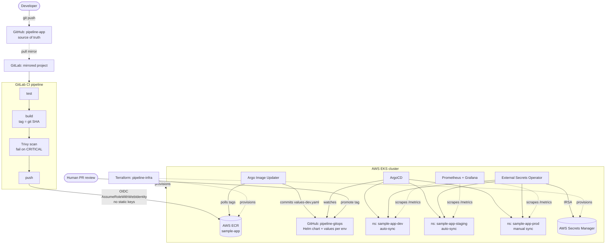

# End-to-End CI/CD + GitOps Platform on AWS

A working GitOps delivery pipeline: push to GitHub, and a container image is
tested, built, scanned, published to ECR, and rolled out to Kubernetes across
three environments — without anyone running `kubectl apply`.

Built with **Terraform, AWS EKS, ECR, GitLab CI, ArgoCD, Argo Image Updater,
External Secrets Operator, and Prometheus/Grafana.**

> **Three repositories make up this project**
> - **[pipeline-infra](.)** — Terraform, bootstrap scripts, and this README *(you are here)*
> - **[pipeline-app](../app)** — the sample application and its GitLab CI pipeline
> - **[pipeline-gitops](../gitops)** — Helm chart, per-environment values, ArgoCD Applications

<!-- Replace with a recording of the rollback demo once captured. -->


---

## Architecture



**The flow:** a push to GitHub is mirrored into GitLab, which runs the pipeline
and lands a SHA-tagged image in ECR. Argo Image Updater — running *inside* the
cluster — notices the new tag and commits it to the GitOps repo. ArgoCD sees
the commit and syncs dev. Staging and production move forward only when a human
merges a promotion PR.

---

## Design decisions worth explaining

These are the choices an interviewer is most likely to ask about, and why each
one went the way it did.

### CI has no access to the cluster

The GitLab role can push to exactly one ECR repository. It holds **no EKS
permissions at all**. Deployment is not something CI does — it is something
ArgoCD does, driven by the state of the GitOps repo.

This is the difference between a pipeline that *pushes* and a platform that
*converges*. It also shrinks the blast radius of a leaked CI credential from
"full cluster access" to "can publish one image".

### No long-lived AWS credentials anywhere

GitLab CI authenticates through **OIDC federation**: each job mints a
short-lived JWT, and AWS exchanges it for temporary credentials. The trust
policy is scoped by `sub` to one project on one branch, so another GitLab
project cannot assume the role even though the provider is shared.

In-cluster components use **IRSA** — each ServiceAccount is bound to its own
narrowly-scoped role. The only static credential in the entire system is a
GitHub token that lets Argo Image Updater push its commits, and that lives in a
Kubernetes Secret rather than in git.

### Image Updater writes to git, not to the cluster

Argo Image Updater can patch a running Deployment directly. It is configured
here to **commit to the GitOps repo instead** (`write-back-method: git`).

Patching the cluster would make the live state diverge from git — which ArgoCD
would then immediately report as drift, and `selfHeal` would revert. Writing to
git keeps a single source of truth and leaves an audit trail: every deploy is a
commit you can `git log`, diff, and revert.

### dev is automated; staging and prod are gated

Only the dev Application carries Image Updater annotations, and only dev is
selected by the `ImageUpdater` resource that Image Updater v1.x needs before it
will act on anything. That one configuration detail — made twice, on purpose —
is the entire promotion model:

| Environment | Moves forward when | Sync |
|-------------|-------------------|------|
| **dev** | a new image lands in ECR | automatic |
| **staging** | a promotion PR is merged | automatic |
| **prod** | a promotion PR is merged **and** someone syncs | manual |

Promotion is a pull request that copies a known-good tag from one values file
to the next. Production needs two distinct human actions — approving the merge
and triggering the release.

### Terraform owns AWS; Helm owns the cluster

Terraform provisions the VPC, EKS, ECR, IAM, and Secrets Manager. It does
**not** install ArgoCD or anything else that runs *on* the cluster — that is
`bootstrap/install.ps1`.

Terraform's Kubernetes and Helm providers need a reachable cluster at *plan*
time, which turns one clean apply into a fragile two-phase dance and couples
infrastructure state to workload state. Splitting them keeps `terraform apply`
and `terraform destroy` reliable, which is what makes the spin-up/spin-down
workflow below trustworthy. The seam between the two halves is the IRSA role
ARNs in `envs/cluster/outputs.tf`, which the bootstrap script reads directly.

### Readiness fails closed

The app requires `APP_GREETING`, supplied from Secrets Manager via External
Secrets Operator. Missing it does not crash the process — `/healthz` still
returns 200, so Kubernetes will not restart-loop a pod that is merely
misconfigured. But `/readyz` returns 503, so the pod never receives traffic and
ArgoCD reports the Application **Degraded**.

This is what the rollback demo exploits: a deploy that passes every test in CI
and still gets caught at the cluster boundary.

---

## Repository layout

```
infra/
  bootstrap-state/     one-time: S3 state bucket + DynamoDB lock table
  envs/cluster/        the single Terraform root for everything else
  modules/
    networking/        VPC, subnets, single NAT, EKS discovery tags
    eks/               control plane, node group, addons, OIDC issuer
    ecr/               repository, lifecycle policy, immutable tags
    iam-oidc-gitlab/   GitLab OIDC provider + scoped ECR-push role
    irsa/              per-ServiceAccount roles for in-cluster components
  bootstrap/
    install.ps1                installs ArgoCD, ESO, Image Updater, Prometheus
    cluster-secret-store.yaml  binds ESO to AWS Secrets Manager
    pre-destroy-cleanup.ps1    releases K8s-owned load balancers before destroy
  docs/
    usage.md                   step-by-step setup guide + troubleshooting
    rollback-demo.md           runbook for the demo recording
    first-run-retrospective.md what broke on the first real run, and why
    architecture.mmd           diagram source
```

---

## Getting it running

> **[→ Full setup guide](docs/usage.md)** — every step from empty AWS account to
> working pipeline, with verification checkpoints and troubleshooting. Start
> there if you are actually building this. The summary below is the shape of it.
>
> **[→ First-run retrospective](docs/first-run-retrospective.md)** — the first
> run against real AWS: what failed, the root causes, the fixes, and what they
> taught. Every issue in it passed validate, plan, lint and template, and only
> showed up on real infrastructure.

**Prerequisites:** AWS account with credentials configured, plus `terraform`,
`aws`, `kubectl`, and `helm` on PATH. A GitLab **Premium or Ultimate** group
(the 30-day Ultimate trial works; the Free tier cannot pull-mirror), and a
GitHub token with `repo` scope.

### 1. State backend (once, ever)

```bash
cd bootstrap-state
terraform init && terraform apply
terraform output -raw backend_config    # paste into ../envs/cluster/backend.tf
```

### 2. AWS infrastructure (~20 minutes)

```bash
cd ../envs/cluster
cp terraform.tfvars.example terraform.tfvars
#   set gitlab_allowed_subjects to your mirrored GitLab project path
terraform init && terraform apply
```

### 3. Cluster platform (~5 minutes)

```powershell
cd ../../bootstrap
.\install.ps1 -GitHubUser <your-handle> -GitHubToken <ghp_...>
```

The script reads the Terraform outputs directly, so there is nothing to copy by
hand. It prints the ArgoCD and Grafana passwords when it finishes.

### 4. Wire up GitLab

1. Create a GitLab project **inside your Premium/Ultimate group** and configure
   it as a **pull mirror** of the GitHub app repo (*Settings → Repository →
   Mirroring*, direction **Pull**, with *Trigger pipelines for mirror updates*
   ticked).
2. Add these CI/CD variables — none are secrets, so none need masking:

   ```bash
   terraform -chdir=envs/cluster output gitlab_ci_variables
   ```

   | Variable | Source |
   |----------|--------|
   | `AWS_ROLE_ARN` | Terraform output |
   | `AWS_REGION` | Terraform output |
   | `ECR_REPOSITORY` | Terraform output |

3. Confirm `main` is a **protected branch**. The IAM trust policy pins project
   and branch; protection is what controls who can push to that branch.

### 5. Register the Applications

Replace the `<ACCOUNT_ID>` and `<GITHUB_USER>` placeholders in the GitOps repo,
push, then register the three Applications and the `ImageUpdater` that selects
dev:

```bash
kubectl apply -f ../gitops/apps/root/
```

Push a commit to the app repo and watch dev deploy itself.

---

## Cost and teardown

This cluster is not meant to run continuously. Standing cost, us-east-1:

| Component | Qty | Rate | Per hour |
|-----------|-----|------|----------|
| EKS control plane | 1 | $0.10/hr | **$0.100** |
| Network Load Balancer | 3 | $0.0225/hr | **$0.068** |
| NAT Gateway | 1 | $0.045/hr | **$0.045** |
| t3.medium nodes (SPOT) | 2 | ~$0.016/hr | **$0.033** |
| EBS gp3 root volumes | 60 GB | $0.08/GB-mo | $0.007 |
| Secrets Manager | 3 | $0.40/mo | $0.002 |
| ECR / S3 / DynamoDB | — | — | <$0.001 |
| | | | **≈ $0.25/hr** |

| Duration | Cost |
|----------|------|
| 3-hour build or demo session | **~$0.75** |
| Full working day | ~$2 |
| Forgotten over a weekend | ~$12 |
| Left up for a month | **~$185** |

**One NLB per environment** is the surprise here — dev, staging and prod each
get one, making load balancers the second-largest line item. Running dev alone
saves ~$0.045/hr.

Two settings materially change the total: `node_capacity_type = "ON_DEMAND"`
adds ~$0.05/hr, and an out-of-support `cluster_version` adds **$0.50/hr** (see
below). Everything is tagged `Project = pipeline-portfolio` for Cost Explorer.

> **Keep `cluster_version` in standard support.** A Kubernetes version that has
> aged into extended support costs **$0.60/hour instead of $0.10** — six times
> the price, applied silently with no change to your configuration. As of
> September 2026 that means 1.34, 1.35 or 1.36. The default here is 1.35.

### Tearing down

```powershell
cd bootstrap
.\pre-destroy-cleanup.ps1
terraform -chdir=..\envs\cluster destroy
```

**Run the cleanup script first.** A `Service type=LoadBalancer` causes
Kubernetes — not Terraform — to create an NLB and a set of ENIs in your
subnets. Terraform has no idea they exist, so `destroy` reaches the subnets,
hits `DependencyViolation`, and hangs for ~20 minutes before failing. The script
deletes the Kubernetes objects and then *polls AWS* until the load balancers and
their ENIs are genuinely gone, because that teardown is asynchronous.

The state bucket from step 1 is deliberately outside this cycle and survives.

Rough timings: apply ~20 min, platform install ~5 min, destroy ~15 min.

---

## What I would add next

- **Progressive delivery** — Argo Rollouts for canary/blue-green instead of a
  plain rolling update, with automated analysis against the Prometheus metrics
  already being scraped.
- **Policy enforcement** — Kyverno or OPA Gatekeeper to reject images that did
  not come from the expected ECR repository.
- **Tighter supply chain** — image signing with cosign, verified at admission.
- **An app-of-apps** — managing the platform components themselves through
  ArgoCD rather than the bootstrap script, so the cluster converges on its own
  definition too.
